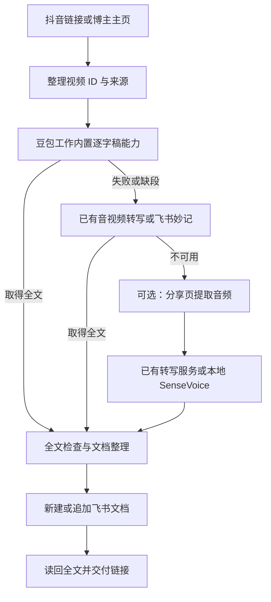

# 小伟的抖音逐字稿存飞书

把抖音里的口播留下来，放进能阅读、能回查的飞书文档。

这是一个面向 **豆包工作** 的 Agent Skill。你提供抖音分享链接、视频链接或博主主页，它指导豆包工作获取完整逐字稿，保留来源，整理成文档并写入飞书，最后读回检查。

**运行环境：豆包工作 · 默认输出：飞书云文档 · 当前版本：v1.0.0**

[下载技能包](https://github.com/siuserxiaowei/xiaowei-douyin-to-feishu/releases/download/v1.0.0/xiaowei-douyin-to-feishu-v1.0.0.zip) · [查看 Skill](xiaowei-douyin-to-feishu/SKILL.md) · [详细使用说明](docs/usage.md) · [验证记录](docs/verification.md)

## 能做什么

| 你提供什么 | 它会做什么 |
|---|---|
| 一条抖音分享链接或视频链接 | 获取口播全文，保留原视频链接，保存为飞书文档 |
| 多条视频链接 | 按视频 ID 去重，默认合并成一篇文档，每条视频一个章节 |
| 博主主页 | 默认整理最近发布的 5 条公开视频；可指定数量 |
| 已有飞书文档链接 | 先读后追加，复用已存在的完整稿件，保留原有内容 |
| “只要逐字稿” | 保留原文和来源，省略 AI 内容速览 |
| 获取失败或缺段的视频 | 记录具体原因，尝试可用备用路径，继续处理其他视频 |

主页采集按可核实的发布时间判断顺序，置顶不代表最新。如果只能看到部分作品，会说明采集范围。

## 文档里有什么

每条视频包含：

- **来源信息**：原视频链接、视频 ID、作者、发布时间、采集时间；未知信息明确标注。
- **全文状态**：全文已取回、部分内容、未取得逐字稿，或经确认没有口播。
- **内容速览**：默认 1–3 条，标记“AI 提炼”，可关闭。
- **逐字稿**：保留口语、重复、否定、数字和原有表达，按段落阅读。
- **必要说明**：有缺段或转写疑点时，放在正文前面说明。

逐字稿保留作者自己的表达。我们简洁、直接的文风用于说明与内容速览，不用于重写原话。全文取回也不等于逐字校对准确。

## 安装到豆包工作

### 方式一：让豆包工作读取仓库

把下面这段话发给豆包工作：

```text
请读取这个仓库：
https://github.com/siuserxiaowei/xiaowei-douyin-to-feishu

找到 xiaowei-douyin-to-feishu/SKILL.md，阅读并按当前豆包工作支持的方式安装。
请保留 references、scripts、licenses 和 THIRD_PARTY_NOTICES.md，确保相对路径有效。

安装时先检查内置取稿、浏览器和飞书文档能力是否可用。
安装过程不下载视频、不新建飞书文档，也不自动安装本地语音模型。
完成后告诉我实际安装位置、可用能力和缺少的条件。
```

如果豆包工作无法访问仓库，使用下方 ZIP 方式。私有仓库需要有访问权限的账号；仅凭链接不能读取私有内容。

### 方式二：上传 ZIP 技能包

1. 在 [v1.0.0 发布页](https://github.com/siuserxiaowei/xiaowei-douyin-to-feishu/releases/tag/v1.0.0) 下载 `xiaowei-douyin-to-feishu-v1.0.0.zip`。也可以从 [仓库 dist 目录](dist/) 下载同一份包。
2. 将 ZIP 交给豆包工作，或通过当前版本提供的技能导入入口导入。
3. 告诉它：

```text
请解压这个技能包，阅读其中的 SKILL.md，并安装到当前豆包工作的技能环境。
保留整个文件夹及其配套文件，完成后检查抖音取稿和飞书文档能力是否可用。
```

不同豆包工作版本的安装入口和工具能力可能不同，以当前环境支持的方式为准。只复制 `SKILL.md` 会缺失配套参考文件和备用脚本。

## 怎么使用

先用一条真实公开视频验证“取稿 → 写入 → 读回”，再扩大批量。将下面方括号里的说明替换成实际链接。

### 单条视频，新建飞书文档

```text
用“抖音逐字稿存飞书”处理这个链接：[抖音链接]。
取完整口播，保留原话，附 3 条以内的内容速览，保存为一篇新的飞书文档。
完成后读回检查，给我文档链接和缺失情况。
```

没有指定飞书目标时，默认在当前用户可写的空间新建文档；只有位置或权限确实无法确定时才询问。

### 多条视频，追加到已有文档

```text
把下面这些抖音视频的完整逐字稿追加到这篇飞书文档：[飞书文档链接]。
已有的视频不要重复写，保留原有内容。

[抖音链接 1]
[抖音链接 2]
[抖音链接 3]
```

### 博主主页，指定数量

```text
整理这个博主最近发布的 5 条公开视频：[博主主页链接]。
每条保留完整逐字稿和来源，合并存入一篇飞书文档。
注意置顶作品不一定是最新发布。
```

### 只保留逐字稿

```text
把这个抖音转成逐字稿存到飞书：[抖音链接]。
只保留原文、来源和必要的缺失说明，不加内容速览。
```

## 它如何工作



优先使用豆包工作已具备的能力。备用脚本参考了移动分享页提取播放地址的方法，再用 FFmpeg 提取音轨；本地 SenseVoice 只在所需依赖和模型条件具备时使用。

`web.fetch` 的逐字稿能力属于目标运行环境。普通网页抓取工具即使名称相同，也不一定能返回抖音口播。平台页面、登录状态和风控变化同样可能影响采集。

## 运行条件

| 路径 | 需要什么 |
|---|---|
| 默认工作流 | 豆包工作中可用的取稿能力，以及当前用户的飞书文档写入权限 |
| 博主主页读取 | 可用浏览器；页面要求登录时由用户完成登录 |
| 飞书妙记回退 | 当前环境已经连接、获授权且可用的妙记转写链路 |
| 本包音频提取脚本 | Python 3.10+、FFmpeg、可访问的抖音分享页 |
| 可选本地转写 | FunASR、ModelScope、PyTorch、torchaudio 及 SenseVoice 模型 |
| CLI 写飞书 | 已安装并完成相应授权的 `lark-cli`；已有连接器可用时优先用连接器 |

默认使用不要求先安装整套本地语音模型。首次下载模型可能较大；是否启用备用路径由当前环境和任务需要决定。

## 验证情况

当前版本已完成 **21 项本地测试**、Skill 格式检查、实际 FFmpeg 合成音频提取、Markdown 原文保留检查，以及飞书创建命令的 dry-run。

**尚未完成豆包工作内的真实端到端验收。** 在线抖音下载、豆包取稿、真实语音识别质量及飞书远端写入仍需用真实链接和目标账号验证。dry-run 通过不代表已获得远端写入权限。

在仓库根目录运行离线测试：

```bash
python3 -m unittest discover -s tests -v
```

FFmpeg 未安装时，对应合成音频测试会跳过；其余测试使用标准库和人工数据。详细范围见 [验证记录](docs/verification.md)。

## 仓库结构

```text
xiaowei-douyin-to-feishu/
├── SKILL.md
├── references/              # 取稿、文档格式、飞书写入
├── scripts/                 # 可选音频回退、Markdown 生成
├── licenses/                # 第三方许可
└── THIRD_PARTY_NOTICES.md
docs/                        # 使用说明、验证记录
tests/                       # 离线测试
dist/                        # 可导入 ZIP 与校验和
```

脚本负责音频提取、可选转写和正文格式化；完整的取稿、飞书保存与恢复流程由豆包工作按照 Skill 指令执行。

## 参考与署名

- [jinchenma94/social-media-data-tools](https://github.com/jinchenma94/social-media-data-tools)：参考豆包工作取稿、分页读取与妙记回退思路。本仓库的指令重新编写，未复制其 Skill 正文。
- [chubbyguan/chubbyskills](https://github.com/chubbyguan/chubbyskills)：音频备用脚本的分享页解析与 SenseVoice 调用据其代码改编，保留 Chubby 的 MIT 许可。

具体来源版本与第三方许可见 [THIRD_PARTY_NOTICES.md](xiaowei-douyin-to-feishu/THIRD_PARTY_NOTICES.md)。仅处理你有权访问和使用的素材；原视频内容的权利归其权利人所有。
