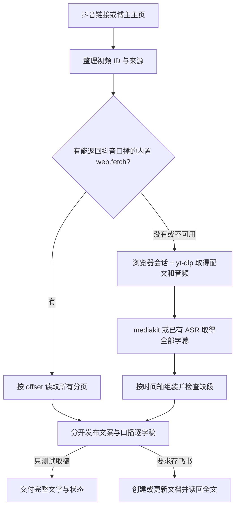

# 小伟的抖音逐字稿存飞书

从抖音链接分别取得页面发布文案与视频口播逐字稿；确认取稿正常后，可保存到飞书文档。

这是一个面向 **豆包工作** 的 Agent Skill。你可以先用一条链接只测试提取，直接查看完整文字；明确要求存飞书时，再创建或更新文档并读回检查。

**运行环境：豆包工作 · 支持只测试取稿或保存飞书 · 当前版本：v1.1.0**

[下载技能包](https://github.com/siuserxiaowei/xiaowei-douyin-to-feishu/releases/download/v1.1.0/xiaowei-douyin-to-feishu-v1.1.0.zip) · [查看 Skill](xiaowei-douyin-to-feishu/SKILL.md) · [详细使用说明](docs/usage.md) · [验证记录](docs/verification.md)

## 能做什么

| 你提供什么 | 它会做什么 |
|---|---|
| 一条抖音分享链接或视频链接 | 分别取得页面发布文案与口播逐字稿，标明来源和完整性 |
| “先测试能否提取” | 直接交付完整文字和取稿状态，不创建飞书文档 |
| “存到飞书” | 取得全文后创建或更新云文档，读回核对并交付链接 |
| 多条视频链接 | 按视频 ID 去重，默认合并成一篇文档，每条视频一个章节 |
| 博主主页 | 默认整理最近发布的 5 条公开视频；可指定数量 |
| 已有飞书文档链接 | 先读后追加，复用已存在的完整稿件，保留原有内容 |
| “只要逐字稿” | 保留口播原文和来源，省略页面配文与 AI 内容速览 |
| 获取失败或缺段的视频 | 记录具体原因，尝试可用备用路径，继续处理其他视频 |

主页采集按可核实的发布时间判断顺序，置顶不代表最新。如果只能看到部分作品，会说明采集范围。

## 文档里有什么

每条视频包含：

- **来源信息**：原视频链接、视频 ID、作者、发布时间、采集时间；未知信息明确标注。
- **全文状态**：全文已取回、部分内容、未取得逐字稿，或经确认没有口播。
- **发布文案**：抖音页面的标题、简介或配文（若取得），与口播分开。
- **内容速览**：默认 1–3 条，标记“AI 提炼”，可关闭。
- **逐字稿**：保留口语、重复、否定、数字和原有表达，按段落阅读。
- **必要说明**：有缺段或转写疑点时，放在正文前面说明。

逐字稿保留作者自己的表达。我们简洁、直接的文风用于说明与内容速览，不用于重写原话。全文取回也不等于逐字校对准确。

## 安装到豆包工作

### 方式一：让豆包工作读取仓库

把下面这段话发给豆包工作：

```text
请读取这个仓库：
https://github.com/siuserxiaowei/xiaowei-douyin-to-feishu

找到 xiaowei-douyin-to-feishu/SKILL.md，阅读并按当前豆包工作支持的方式安装。
请保留 references、scripts、licenses 和 THIRD_PARTY_NOTICES.md，确保相对路径有效。

安装时先检查内置取稿、浏览器、yt-dlp、mediakit 转写和飞书文档能力是否可用。
安装过程不下载视频、不新建飞书文档，也不自动安装本地语音模型。
完成后告诉我实际安装位置、可用能力和缺少的条件。
```

如果豆包工作无法访问仓库，使用下方 ZIP 方式。私有仓库需要有访问权限的账号；仅凭链接不能读取私有内容。

### 方式二：上传 ZIP 技能包

1. 在 [v1.1.0 发布页](https://github.com/siuserxiaowei/xiaowei-douyin-to-feishu/releases/tag/v1.1.0) 下载 `xiaowei-douyin-to-feishu-v1.1.0.zip`。也可以从 [仓库 dist 目录](dist/) 下载同一份包。
2. 将 ZIP 交给豆包工作，或通过当前版本提供的技能导入入口导入。
3. 告诉它：

```text
请解压这个技能包，阅读其中的 SKILL.md，并安装到当前豆包工作的技能环境。
保留整个文件夹及其配套文件，完成后检查抖音取稿和飞书文档能力是否可用。
```

不同豆包工作版本的安装入口和工具能力可能不同，以当前环境支持的方式为准。只复制 `SKILL.md` 会缺失配套参考文件和备用脚本。

## 怎么使用

先用一条真实公开视频只测试取稿，确认发布文案与口播都能识别，再决定是否保存飞书。将下面方括号里的说明替换成实际链接。

### 只测试提取抖音文案

```text
用 `xiaowei-douyin-to-feishu` Skill 处理这个链接：[抖音链接]。
这次只测试提取，不创建飞书文档。请分别给我页面发布文案和完整口播逐字稿，说明是内置取稿还是 ASR、是否读完所有分页或字幕、有无缺段。不要用标题或摘要代替口播。
```

### 单条视频，新建飞书文档

```text
用“抖音逐字稿存飞书”处理这个链接：[抖音链接]。
取完整口播，保留原话，附 3 条以内的内容速览，保存为一篇新的飞书文档。
完成后读回检查，给我文档链接和缺失情况。
```

没有指定飞书目标时，默认在当前用户可写的空间新建文档；只有位置或权限确实无法确定时才询问。

### 多条视频，追加到已有文档

```text
把下面这些抖音视频的完整逐字稿追加到这篇飞书文档：[飞书文档链接]。
已有的视频不要重复写，保留原有内容。

[抖音链接 1]
[抖音链接 2]
[抖音链接 3]
```

### 博主主页，指定数量

```text
整理这个博主最近发布的 5 条公开视频：[博主主页链接]。
每条保留完整逐字稿和来源，合并存入一篇飞书文档。
注意置顶作品不一定是最新发布。
```

### 只保留逐字稿

```text
把这个抖音转成逐字稿存到飞书：[抖音链接]。
只保留原文、来源和必要的缺失说明，不加内容速览。
```

## 它如何工作



上游 [social-media-data-tools](https://github.com/jinchenma94/social-media-data-tools) 的快速路径是调用豆包工作内置 `web.fetch` 并按偏移量读完分页；它没有提供这个工具的实现。在此前实际测试的豆包工作环境中，该工具不可用，浏览器会话 + `yt-dlp` + mediakit Cloud ASR 已成功取得口播。新版将已完成的 ASR 分段稳定组装并检查缺段；已知拒绝抖音的 `doubao-video-extract` 不会被当作必经回退。

**只测试取稿时，不会新建飞书文档；要求存飞书时，必须读回新增逐字稿全文才算完成。** 已有 `run.json` 和 `transcript.txt` 时，运行 `scripts/publish_feishu.py <run.json>` 可以直接续跑飞书阶段。平台页面、登录状态和风控变化可能影响采集。

## 运行条件

| 路径 | 需要什么 |
|---|---|
| 内置快路径 | 当前豆包工作会话实际提供能返回抖音口播的 `web.fetch` |
| 音频回退 | 可用浏览器会话、`yt-dlp`、FFmpeg 和实际可调用的 ASR 服务 |
| 博主主页读取 | 可用浏览器；页面要求登录时由用户完成登录 |
| 飞书妙记回退 | 当前环境已经连接、获授权且可用的妙记转写链路 |
| 本包音频提取脚本 | Python 3.10+、FFmpeg、`yt-dlp`；若需登录视频，需可访问的浏览器会话 |
| 可选本地转写 | FunASR、ModelScope、PyTorch、torchaudio 及 SenseVoice 模型 |
| CLI 写飞书 | 已安装并完成相应授权的 `lark-cli`；已有连接器可用时优先用连接器 |

默认使用不要求先安装整套本地语音模型。首次下载模型可能较大；是否启用备用路径由当前环境和任务需要决定。

## 验证情况

2026-09-24 已在豆包工作真实处理一条 3 分 44 秒的抖音视频：通过浏览器会话、`yt-dlp` 和 mediakit Cloud ASR 取得 142 段、1241 字的逐字稿，再写入飞书并读回全文核对。新版又用同一视频在线重取页面配文和音轨，将保存的 142 段 ASR 结果重新组装，所得文字与原稿逐字一致；46 项离线测试通过。语音识别结果未经过人工逐字校对，内置 `web.fetch` 路径在该环境无法实测。具体验证边界见 [验证记录](docs/verification.md)。

在仓库根目录运行离线测试：

```bash
python3 -m unittest discover -s tests -v
```

FFmpeg 未安装时，对应合成音频测试会跳过；其余测试使用标准库和人工数据。详细范围见 [验证记录](docs/verification.md)。

## 仓库结构

```text
xiaowei-douyin-to-feishu/
├── SKILL.md
├── references/              # 取稿、文档格式、飞书写入
├── scripts/                 # 音频提取、ASR 分段组装、Markdown 与飞书续跑
├── licenses/                # 第三方许可
└── THIRD_PARTY_NOTICES.md
docs/                        # 使用说明、验证记录
tests/                       # 离线测试
dist/                        # 可导入 ZIP 与校验和
```

脚本负责音频提取、ASR 分段组装、可选本地转写、正文格式化和飞书发布续跑；豆包工作按 Skill 指令调用当前实际可用的内置取稿或云端转写能力。

## 参考与署名

- [jinchenma94/social-media-data-tools](https://github.com/jinchenma94/social-media-data-tools)：参考豆包工作取稿、分页读取与妙记回退思路。本仓库的指令重新编写，未复制其 Skill 正文。
- [chubbyguan/chubbyskills](https://github.com/chubbyguan/chubbyskills)：音频备用脚本的分享页解析与 SenseVoice 调用据其代码改编，保留 Chubby 的 MIT 许可。

具体来源版本与第三方许可见 [THIRD_PARTY_NOTICES.md](xiaowei-douyin-to-feishu/THIRD_PARTY_NOTICES.md)。仅处理你有权访问和使用的素材；原视频内容的权利归其权利人所有。
